# Enumerating Active Directory


[TOC]


## The Attack Life Cycle

1. Reconnaissance
2. Initial Exploitation
3. Establish Foothold
4. Escalate Privileges
5. Internal Reconnaissance
6. Lateral Movement
7. Maintain Presence
8. Complete Mission


## Task 1 Why AD Enumeration


Configure the DNS for za.tryhackme.com , 

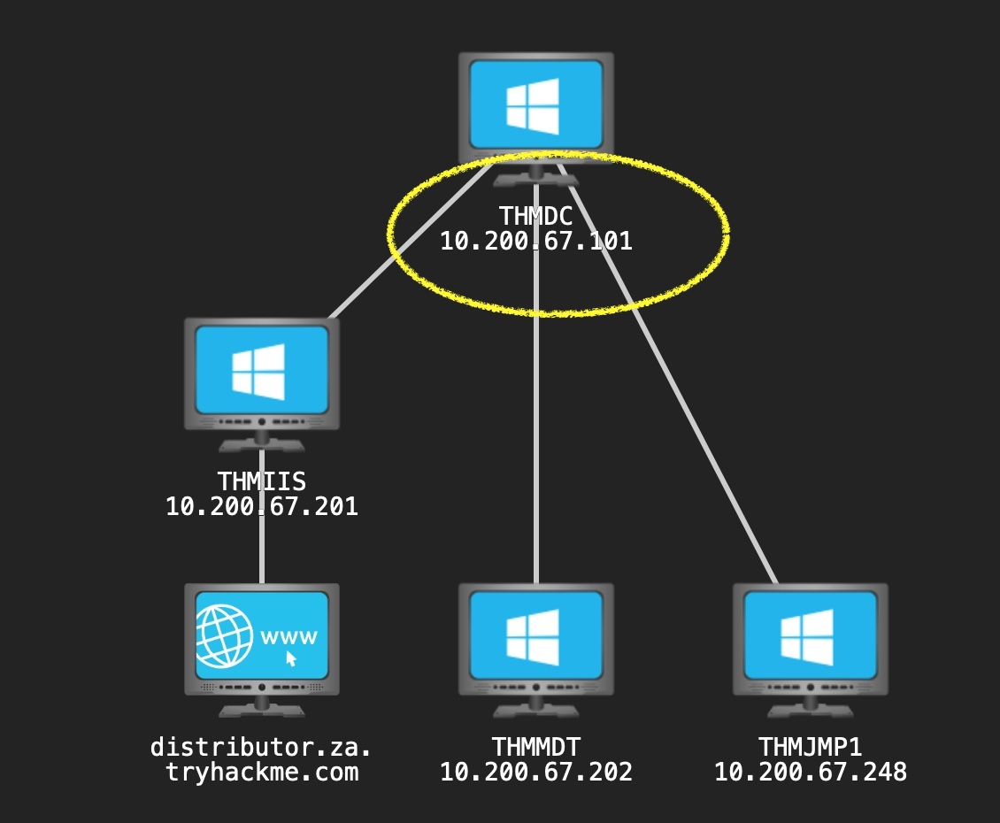

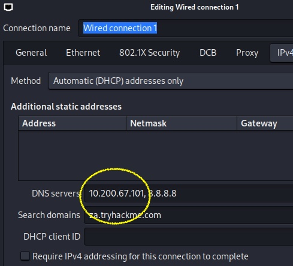

restart the network connection

```bash
$ sudo systemctl restart NetworkManager
```

Check that network connection has been configured correctly .

```bash
$ nslookup thmdc.za.tryhackme.com
```


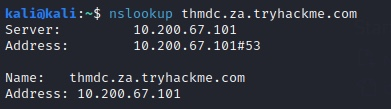

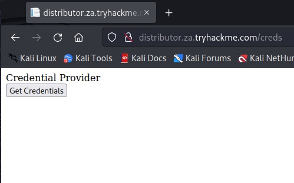

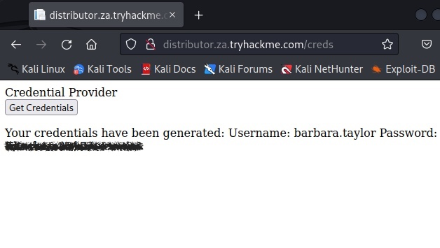


Using SSH

```bash
kali@kali:~$ ssh za.tryhackme.com\\jacqueline.adams@thmjmp1.za.tryhackme.com
za.tryhackme.com\jacqueline.adams@thmjmp1.za.tryhackme.com's password: 
```

Using RDP

```bash
$ xfreerdp /d:za.tryhackme.com /u:jacqueline.adams /p:Gaiw6681 /v:thmjmp1.za.tryhackme.com /drive:. +clipboard 
```


## Task 2 Credential Injection


Let's RDP thmjmp1


```bash
$ xfreerdp /d:za.tryhackme.com /u:mandy.bryan /p:Dbrnjhbz1986 /v:thmjmp1.za.tryhackme.com /drive:. +clipboard /size:1024x640
```


Obtain different credential

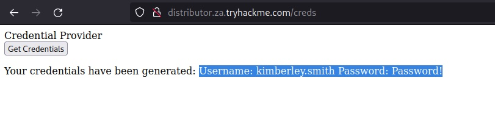

runas.exe /netonly /user:za.tryhackme.com\kimberley.smith cmd.exe

```shell
c:\runas.exe /netonly /user:za.tryhackme.com\kimberley.smith cmd.exe
```


Configuring DNS in windows machine (just for illustration as it requires permissions), the DNS was already configured

```powershell
$dnsip = "<DC IP>"
$index = Get-NetAdapter -Name 'Ethernet' | Select-Object -ExpandProperty 'ifIndex'
Set-DnsClientServerAddress -InterfaceIndex $index -ServerAddresses $dnsip
```


> ***Is there a difference between* *`dir \\za.tryhackme.com\SYSVOL` and `dir \\<DC IP>\SYSVOL`*** 
>
> When we provide the hostname, network authentication will attempt  first to perform Kerberos authentication. Since Kerberos authentication  uses hostnames embedded in the tickets, if we provide the IP instead, we can force the authentication type to be NTLM


### Task 2 Answers

<details>
    <summary>  What native Windows binary allows us to inject credentials legitimately into memory?</summary> 
 <!-- empty line *️⃣  -->
runas.exe
</details>
<details>
    <summary>What parameter option of the runas binary will ensure that the injected credentials are used for all network connections?</summary> <!-- Good place for a CTA (Call to Action) -->
 <!-- empty line *️⃣  -->
/netonly
</details>
<details>
    <summary>What network folder on a domain controller is accessible by any authenticated AD account and stores GPO information?</summary> <!-- Good place for a CTA (Call to Action) -->
 <!-- empty line *️⃣  -->
SYSVOL
</details>
<details>
    <summary>When performing dir \\za.tryhackme.com\SYSVOL, what type of authentication is performed by default?</summary> <!-- Good place for a CTA (Call to Action) -->
 <!-- empty line *️⃣  -->
Kerberos Authentication
</details>


## Task 3 Enumeration through Microsoft Management Console   


```bash
$ xfreerdp /d:za.tryhackme.com /u:damien.horton /p:pABqHYKsG8L7 /v:thmjmp1.za.tryhackme.com /drive:. +clipboard

```

##                          

| 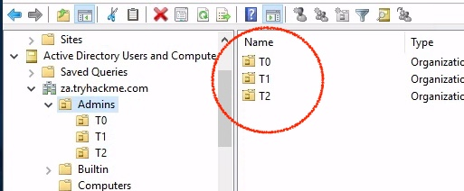                              | 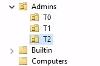                              |
| ------------------------------------------------------------ | ------------------------------------------------------------ |
| 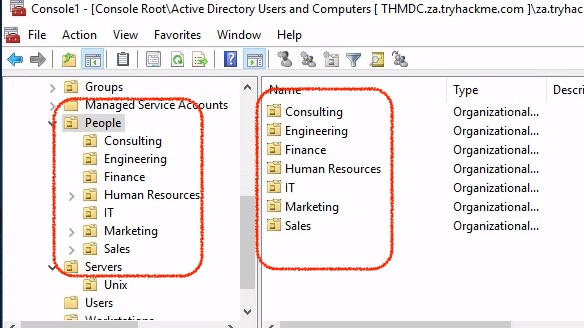                              | 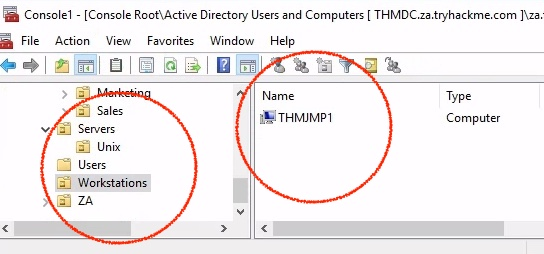                              |
| 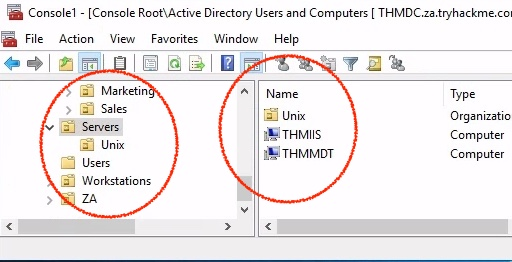                              | 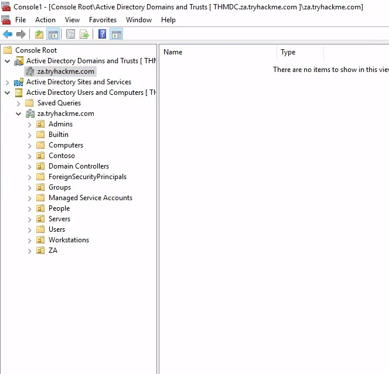 |
| 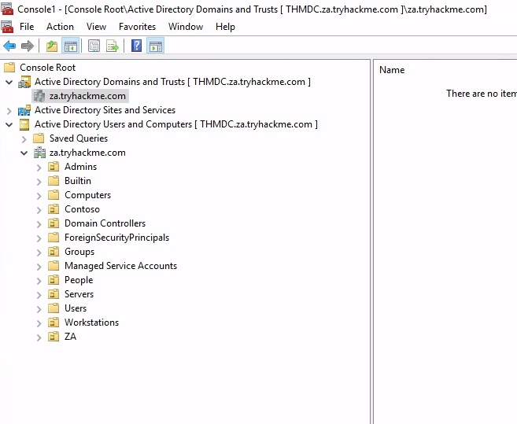 |                                                              |


### Task 3 Answers

<details>
    <summary>How many Computer objects are part of the Servers OU?</summary><!-- Good place for a CTA (Call to Action) --> 
 <!-- empty line *️⃣  -->
2
</details>
<details>
<summary>How many Computer objects are part of the Workstations OU?</summary> <!-- Good place for a CTA (Call to Action) -->
 <!-- empty line *️⃣  -->
1
</details>
<details>
<summary>How many departments (Organisational Units) does this organisation consist of?</summary> <!-- Good place for a CTA (Call to Action) -->
 <!-- empty line *️⃣  -->
7
</details>
<details>
<summary>How many Admin tiers does this organisation have?</summary> <!-- Good place for a CTA (Call to Action) -->
 <!-- empty line *️⃣  -->
3
</details>
<details>
<summary>What is the value of the flag stored in the description attribute of the t0_tinus.green account?</summary> <!-- Good place for a CTA (Call to Action) -->
 <!-- empty line *️⃣  -->
THM{Enumerating.Via.MMC}
</details>


> the credentials will not be verified directly by a domain  controller so that it will accept any password. We still need to confirm that the network credentials are loaded successfully and correctly.


## Task 4 Enumeration through Command Prompt                            


### Enumerating Users

use the net command to list all the users in the AD domain by using the user option

```
C:\Users\jacqueline.adams>net user /domain
```

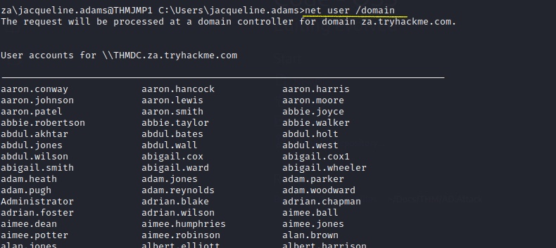


Let's enumerate  more detals about specific users

```shell
C:\Users\jacqueline.adams>net user victoria.russell /domain
```

### 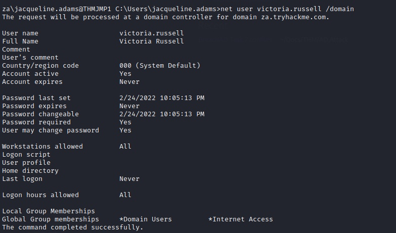

Enumerting the user guest as well

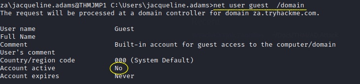

### Enumerating Groups

Use the net command to enumerate groups by adding group option:

```shell
C:\Users\jacqueline.adams>net group /domain
```

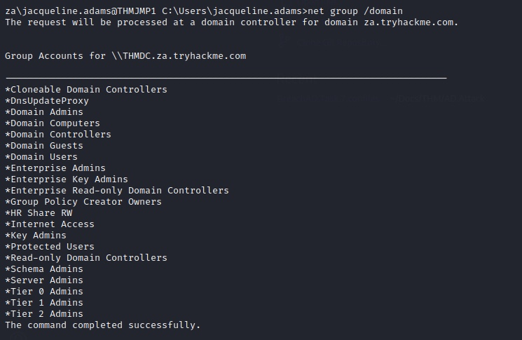

Enumerate more details about members in the group "Tier 1 Admins"

```shell
C:\Users\jacqueline.adams>net group "Tier 1 Admins" /domain
```

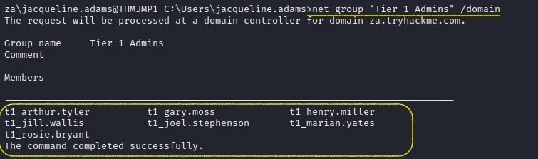


### Password Policy

```shell
C:\Users\jacqueline.adams>net accounts /domain
```

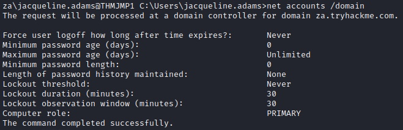


### Task 4 Answers

<details>
    <summary> Apart from the Domain Users group, what other group is the aaron.harris account a member of?</summary> 
 <!-- empty line *️⃣  -->
Internet Access
</details>
<details>
    <summary>Is the Guest account active? (Yay,Nay)</summary> <!-- Good place for a CTA (Call to Action) -->
 <!-- empty line *️⃣  -->
Nay
</details>
<details>
    <summary>How many accounts are a member of the Tier 1 Admins group?</summary> <!-- Good place for a CTA (Call to Action) -->
 <!-- empty line *️⃣  -->
7
</details>
<details>
    <summary>What is the account lockout duration of the current password policy in minutes?</summary> <!-- Good place for a CTA (Call to Action) -->
 <!-- empty line *️⃣  -->
30
</details>


## Task 5 Enumeration through PowerShell                            

Switch command line to powershell

```shell
c:\ > Powershell -executionpolicy bypass
```


### Enumerate Users

#### Get-ADUser 

using the Get-ADUser cmdlet to enumerate user with the below options

- -Identity - The account name that we are enumerating
- -Properties - Which properties associated with the account will be shown, * will show all properties
- -Server - Since we are not domain-joined, we have to use this parameter to point it to our domain controller

```powershell
PS C:\Users\jacqueline.adams> Get-ADUser -Identity gordon.stevens -Server za.tryhackme.com -Properties *
```

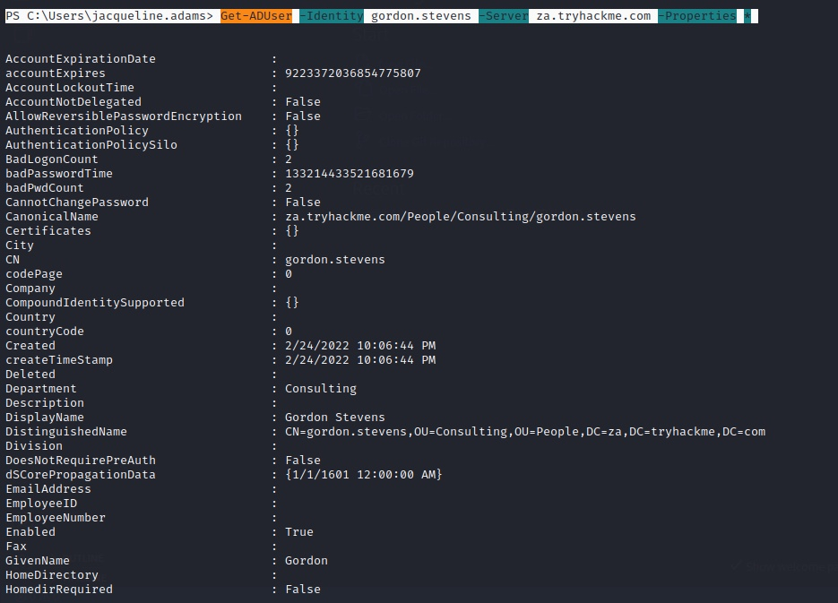


#### Get-ADUser filter

```powershell
PS C:\> Get-ADUser -Filter 'Name -like "*stevens"' -Server za.tryhackme.com | Format-Table Name,SamAccountName -A
```

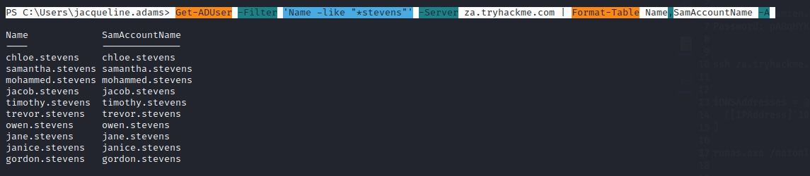

get the Title attribute of Beth Nolan (beth.nolan)

```powershell
PS C:\Users\jacqueline.adams> Get-ADUser -Identity beth.nolan  -Server za.tryhackme.com -Properties * | Format-Table Name,Title -A

```

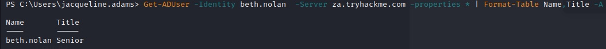

Get the DistinguishedName  name for user annette.manning

```powershell
PS C:\Users\jacqueline.adams> Get-ADUser -Identity annette.manning   -Properties DistinguishedName
```

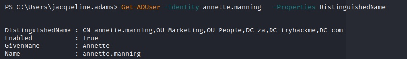


### Enumerating Groups

#### Get-ADGroup

Enumerate groups using Get-ADGroup cmdlet

```shell
PS C:\> Get-ADGroup -Identity Administrators -Server za.tryhackme.com
```

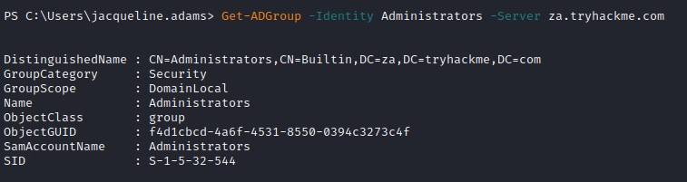

Get the creation date/time of the Tier 2 Admins group

```powershell
PS C:\Users\jacqueline.adams> Get-ADGroup -Filter 'Name -like "Tier 2 Admins"' -Server za.tryhackme.com -Properties Created
-------------------------------------------
Created           : 2/24/2022 10:04:41 PM

```

Get the Value of SID attribute of the Enterprise Admins group

```powershell
PS C:\Users\jacqueline.adams> Get-ADGroup -Filter 'Name -like "Enterprise Admins"' -Server za.tryhackme.com -Properties * | Format-Table Name,SID -A

Name              SID                                          
----              ---
Enterprise Admins S-1-5-21-3330634377-1326264276-632209373-519

```


#### Get-ADGroupMember

Enumerate groups using Get-ADGroupMember cmdlet

```shell
PS C:\> Get-ADGroupMember -Identity Administrators -Server za.tryhackme.com
```

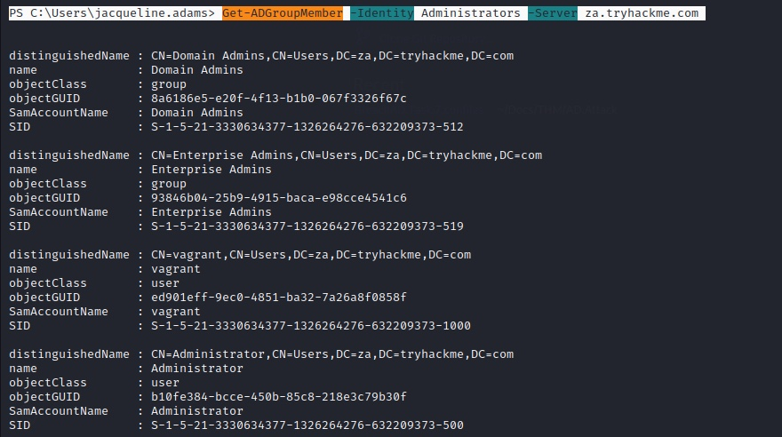

### AD Objects

AD Objects used as generic search for any AD Object, get AD objects were changed after a specific date

```shell
PS C:\> $ChangeDate = New-Object DateTime(2022, 02, 28, 12, 00, 00)
PS C:\> Get-ADObject -Filter 'whenChanged -gt $ChangeDate' -includeDeletedObjects -Server za.tryhackme.com
```

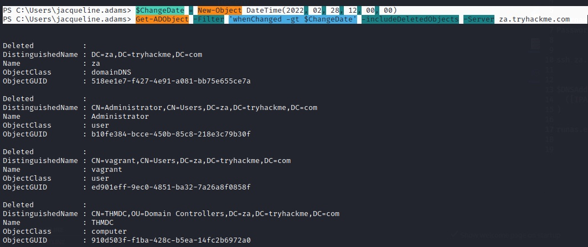

Enumerate accounts to show users in the network who mistyped their password

```shell
PS C:\> Get-ADObject -Filter 'badPwdCount -gt 0' -Server za.tryhackme.com
```


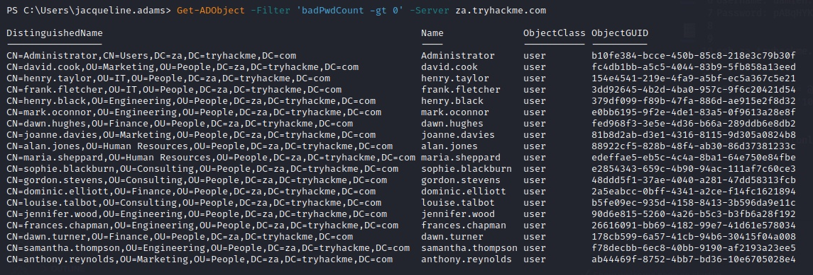

### Domains

#### Get-ADDomain

```shell
PS C:\> Get-ADDomain -Server za.tryhackme.com
```

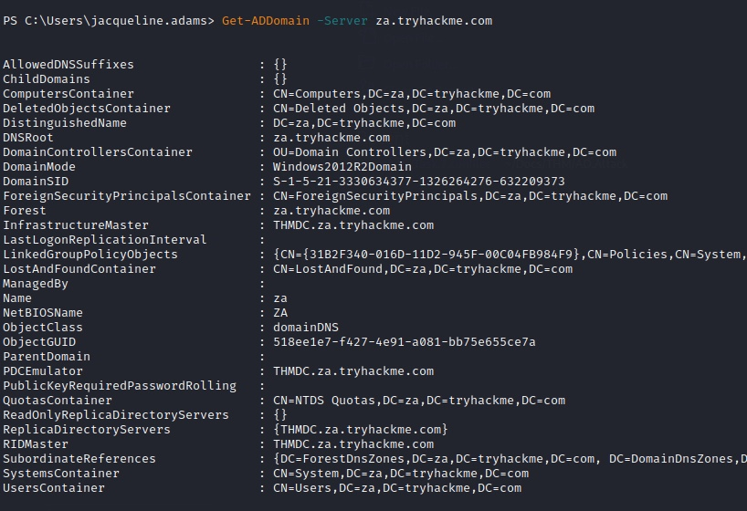

Changing user password

```shell
PS C:\Users\jacqueline.adams> Set-ADAccountPassword -Identity leon.jennings -Server za.tryhackme.com -OldPassword (ConvertTo-SecureString -AsPlaintext "Password!" -force) -NewPassword (ConvertTo-S
ecureString -AsPlainText "Password!new" -Force)                                                                                                                                                     
PS C:\Users\jacqueline.adams>  

```

### Task 5 Answers 

<details>
    <summary>What is the value of the Title attribute of Beth Nolan (beth.nolan)?</summary> 
 <!-- empty line *️⃣  -->
Senior
</details>
<details>
  <summary>What is the value of the DistinguishedName attribute of Annette Manning (annette.manning)?</summary> <!-- Good place for a CTA (Call to Action) -->
 <!-- empty line *️⃣  -->
CN=annette.manning,OU=Marketing,OU=People,DC=za,DC=tryhackme,DC=com
</details>
<details>
    <summary>When was the Tier 2 Admins group created?</summary> <!-- Good place for a CTA (Call to Action) -->
 <!-- empty line *️⃣  -->
2/24/2022 10:04:41 PM
</details>
<details>
    <summary>What is the value of the SID attribute of the Enterprise Admins group?</summary> <!-- Good place for a CTA (Call to Action) -->
 <!-- empty line *️⃣  -->
S-1-5-21-3330634377-1326264276-632209373-519
</details>
<details>
    <summary>Which container is used to store deleted AD objects?</summary> <!-- Good place for a CTA (Call to Action) -->
 <!-- empty line *️⃣  -->
CN=Deleted Objects,DC=za,DC=tryhackme,DC=com
</details>


## Task 6 Enumeration through Bloodhound                            

> _Bloodhound allowed attackers (and by now defenders too) to visualise the AD environment in a graph format with interconnected nodes. Each  connection is a possible path that could be exploited to reach a goal.  In contrast, the defenders used lists, like a list of Domain Admins or a list of all the hosts in the environment.... (TryHackMe)_

We will use Sharphound first to enumerate AD before we can look at the results visually using Bloodhound.


Download the BloodHound zip file 

```bash
$ scp jacqueline.adams@THMJMP1.za.tryhackme.com:C:/tools/121,298 20230301155305_BloodHound.zip  .
```


Run ne4j

```bash
kali@kali:/etc/neo4j$ sudo neo4j console
```


Upload the Bloodhound zip file


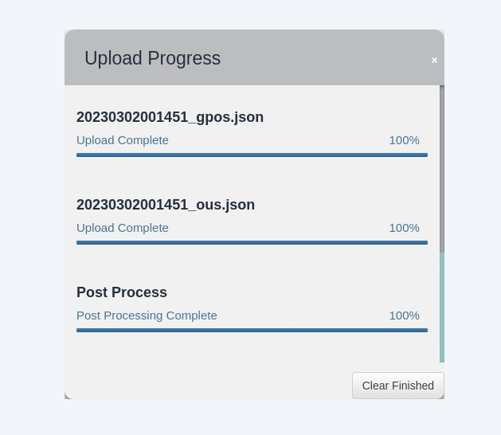


### Pre-Built Analytics Queries


#### Domain Information

Find all domain admins

```cypher
MATCH p=(n:Group)<-[:MemberOf*1..]-(m) WHERE n.objectid =~ "(?i)S-1-5-.*-512" RETURN p
```


Map domain trusts

```cypher
MATCH p=(n:Domain)-->(m:Domain) RETURN p
```


Find Computers with Unsupported Operating Systems

```cypher
MATCH (n:Computer) WHERE n.operatingsystem =~ "(?i).*(2000|2003|2008|xp|vista|7|me).*" RETURN n
```


#### Dangerous Privileges


Find Principals with DCSync Rights

```cypher
MATCH p=()-[:DCSync|AllExtendedRights|GenericAll]->(:Domain {name: "ZA.TRYHACKME.COM"}) RETURN p
```

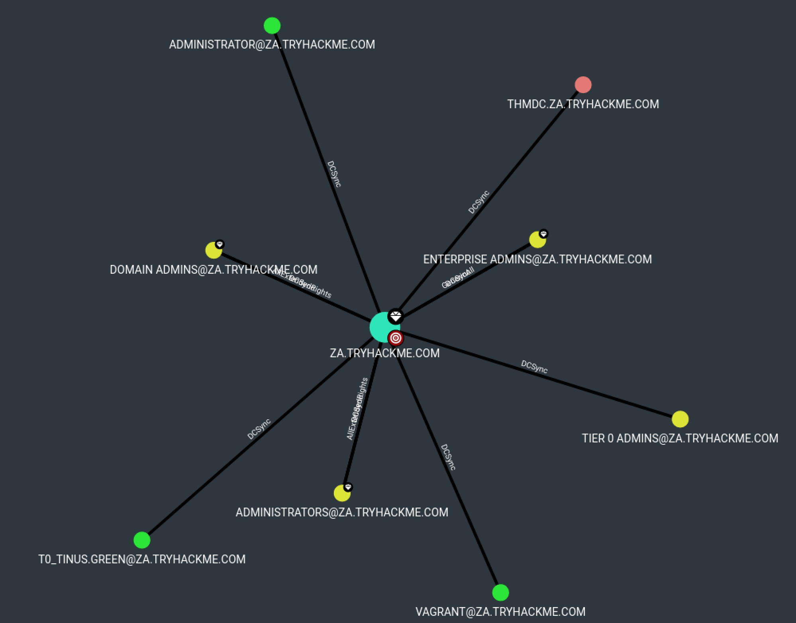

Users with Foreign Domain Group Membership

```cypher
MATCH p=(n:User)-[:MemberOf]->(m:Group) WHERE n.domain="ZA.TRYHACKME.COM" AND m.domain<>n.domain RETURN p
```


Find Computers where Domain Users are Local Admin

```cypher
MATCH p=(m:Group {name:"DOMAIN USERS@ZA.TRYHACKME.COM"})-[:AdminTo]->(n:Computer) RETURN p
```


Find Computers where Domain Users can read LAPS passwords

```cypher
MATCH p=(Group {name:"DOMAIN USERS@ZA.TRYHACKME.COM"})-[:MemberOf*0..]->(g:Group)-[:AllExtendedRights|ReadLAPSPassword]->(n:Computer) RETURN p
```


Find All Paths from Domain Users to High Value Targets

```cypher
MATCH p=shortestPath((g:Group {name:"DOMAIN USERS@ZA.TRYHACKME.COM"})-[*1..]->(n {highvalue:true})) WHERE g<>n return p
```


Find Workstations where Domain Users can RDP

```cypher
match p=(g:Group {name:"DOMAIN USERS@ZA.TRYHACKME.COM"})-[:CanRDP]->(c:Computer) where NOT c.operatingsystem CONTAINS "Server" return p
```


Find Servers where Domain Users can RDP

```cypher
MATCH p=(g:Group {name:"DOMAIN USERS@ZA.TRYHACKME.COM"})-[:CanRDP]->(c:Computer) WHERE c.operatingsystem CONTAINS "Server" return p
```


Find Dangerous Privileges for Domain Users Groups

```cypher
MATCH p=(m:Group)-[:Owns|WriteDacl|GenericAll|WriteOwner|ExecuteDCOM|GenericWrite|AllowedToDelegate|ForceChangePassword]->(n:Computer) WHERE m.objectid ENDS WITH "-513" RETURN p
```


Find Domain Admin Logons to non-Domain Controllers

```cypher
MATCH (dc)-[r:MemberOf*0..]->(g:Group) WHERE g.objectid ENDS WITH '-516' WITH COLLECT(dc) AS exclude MATCH p = (c:Computer)-[n:HasSession]->(u:User)-[r2:MemberOf*1..]->(g:Group) WHERE  g.objectid ENDS WITH '-512' AND NOT c IN exclude RETURN p
```


#### Kerberos Interaction

Find Kerberoastable Members of High Value Groups

```cypher
MATCH p=shortestPath((n:User)-[:MemberOf]->(g:Group)) WHERE g.highvalue=true AND n.hasspn=true RETURN p
```


List all Kerberoastable Accounts

```cypher
MATCH (n:User)WHERE n.hasspn=true RETURN n
```

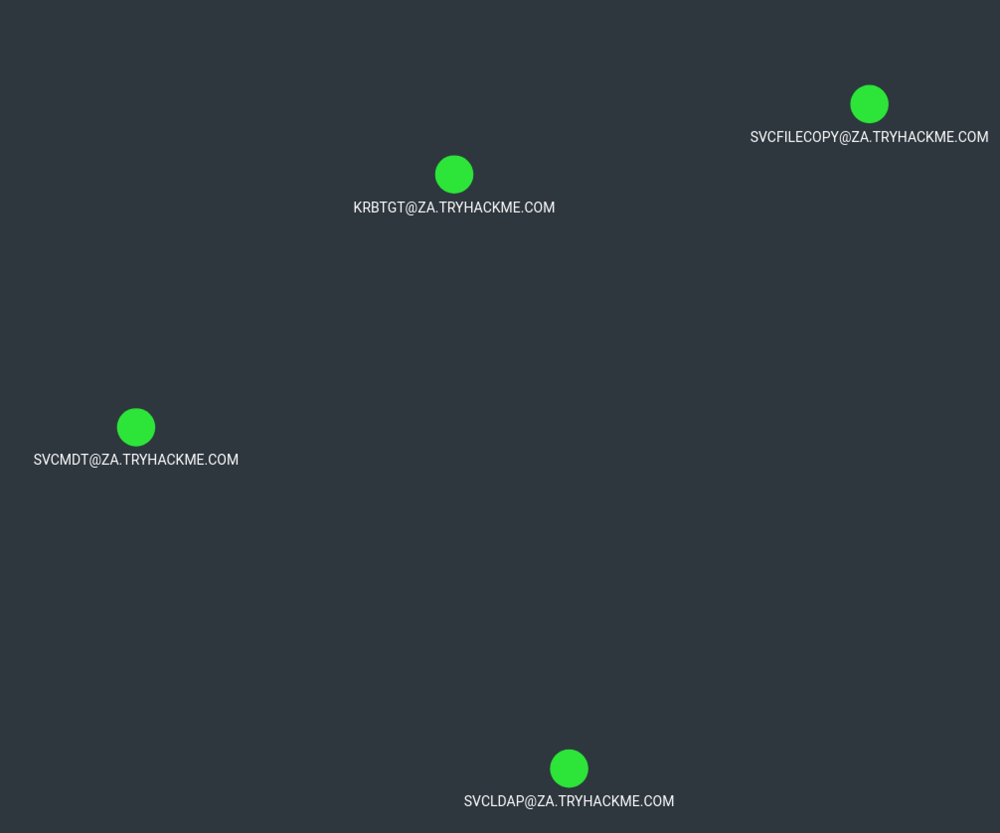

Find Kerberoastable Users with most privileges

```cypher
MATCH (u:User {hasspn:true}) OPTIONAL MATCH (u)-[:AdminTo]->(c1:Computer) OPTIONAL MATCH (u)-[:MemberOf*1..]->(:Group)-[:AdminTo]->(c2:Computer) WITH u,COLLECT(c1) + COLLECT(c2) AS tempVar UNWIND tempVar AS comps RETURN u.name,COUNT(DISTINCT(comps)) ORDER BY COUNT(DISTINCT(comps)) DESC
```


Find AS-REP Roastable Users (DontReqPreAuth)	

```cypher
MATCH (u:User {dontreqpreauth: true}) RETURN u
```

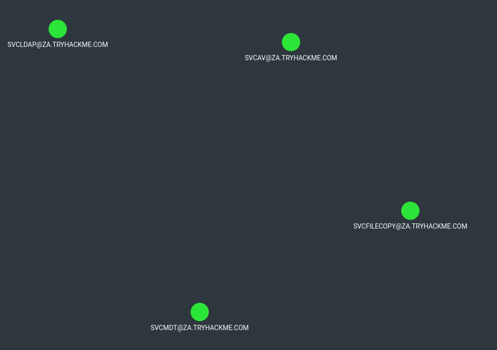

#### Shortest Paths


Shortest Paths to Unconstrained Delegation Systems

```cypher
MATCH (n) MATCH p=shortestPath((n)-[:MemberOf|HasSession|AdminTo|AllExtendedRights|AddMember|ForceChangePassword|GenericAll|GenericWrite|Owns|WriteDacl|WriteOwner|CanRDP|ExecuteDCOM|AllowedToDelegate|ReadLAPSPassword|Contains|GPLink|AddAllowedToAct|AllowedToAct|SQLAdmin|ReadGMSAPassword|HasSIDHistory|CanPSRemote|SyncLAPSPassword|AZAddMembers|AZAddSecret|AZAvereContributor|AZContains|AZContributor|AZExecuteCommand|AZGetCertificates|AZGetKeys|AZGetSecrets|AZGlobalAdmin|AZGrant|AZGrantSelf|AZHasRole|AZMemberOf|AZOwner|AZOwns|AZPrivilegedRoleAdmin|AZResetPassword|AZUserAccessAdministrator|AZAppAdmin|AZCloudAppAdmin|AZRunsAs|AZKeyVaultContributor|AZVMAdminLogin|AddSelf|WriteSPN|AddKeyCredentialLink*1..]->(m:Computer {unconstraineddelegation: true})) WHERE NOT n=m RETURN p
```


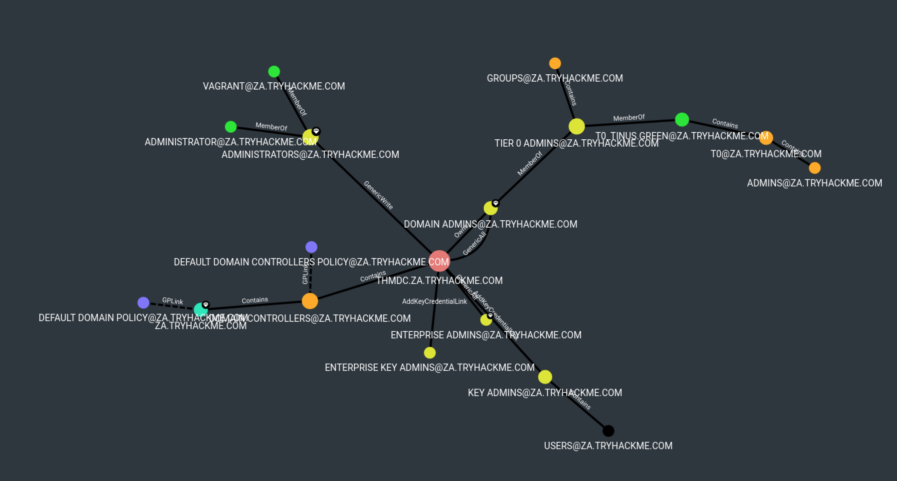


Shortest Paths from Kerberoastable Users

```cypher
MATCH p=shortestPath((a:User {name:"SVCFILECOPY@ZA.TRYHACKME.COM"})-[:MemberOf|HasSession|AdminTo|AllExtendedRights|AddMember|ForceChangePassword|GenericAll|GenericWrite|Owns|WriteDacl|WriteOwner|CanRDP|ExecuteDCOM|AllowedToDelegate|ReadLAPSPassword|Contains|GPLink|AddAllowedToAct|AllowedToAct|SQLAdmin|ReadGMSAPassword|HasSIDHistory|CanPSRemote|SyncLAPSPassword|AZAddMembers|AZAddSecret|AZAvereContributor|AZContains|AZContributor|AZExecuteCommand|AZGetCertificates|AZGetKeys|AZGetSecrets|AZGlobalAdmin|AZGrant|AZGrantSelf|AZHasRole|AZMemberOf|AZOwner|AZOwns|AZPrivilegedRoleAdmin|AZResetPassword|AZUserAccessAdministrator|AZAppAdmin|AZCloudAppAdmin|AZRunsAs|AZKeyVaultContributor|AZVMAdminLogin|AddSelf|WriteSPN|AddKeyCredentialLink*1..]->(b:Computer)) RETURN p
```


Shortest Paths to Domain Admins from Kerberoastable Users

```cypher
MATCH p=shortestPath((n:User {hasspn:true})-[:MemberOf|HasSession|AdminTo|AllExtendedRights|AddMember|ForceChangePassword|GenericAll|GenericWrite|Owns|WriteDacl|WriteOwner|CanRDP|ExecuteDCOM|AllowedToDelegate|ReadLAPSPassword|Contains|GPLink|AddAllowedToAct|AllowedToAct|SQLAdmin|ReadGMSAPassword|HasSIDHistory|CanPSRemote|SyncLAPSPassword|AZAddMembers|AZAddSecret|AZAvereContributor|AZContains|AZContributor|AZExecuteCommand|AZGetCertificates|AZGetKeys|AZGetSecrets|AZGlobalAdmin|AZGrant|AZGrantSelf|AZHasRole|AZMemberOf|AZOwner|AZOwns|AZPrivilegedRoleAdmin|AZResetPassword|AZUserAccessAdministrator|AZAppAdmin|AZCloudAppAdmin|AZRunsAs|AZKeyVaultContributor|AZVMAdminLogin|AddSelf|WriteSPN|AddKeyCredentialLink*1..]->(m:Group {name:"DOMAIN ADMINS@ZA.TRYHACKME.COM"})) RETURN p
```


Shortest Path from Owned Principals

```cypher
MATCH (n:User)WHERE n.hasspn=true RETURN n
```


Shortest Paths to Domain Admins from Owned Principals

```cypher
MATCH p=shortestPath((n {owned:true})-[:MemberOf|HasSession|AdminTo|AllExtendedRights|AddMember|ForceChangePassword|GenericAll|GenericWrite|Owns|WriteDacl|WriteOwner|CanRDP|ExecuteDCOM|AllowedToDelegate|ReadLAPSPassword|Contains|GPLink|AddAllowedToAct|AllowedToAct|SQLAdmin|ReadGMSAPassword|HasSIDHistory|CanPSRemote|SyncLAPSPassword|AZAddMembers|AZAddSecret|AZAvereContributor|AZContains|AZContributor|AZExecuteCommand|AZGetCertificates|AZGetKeys|AZGetSecrets|AZGlobalAdmin|AZGrant|AZGrantSelf|AZHasRole|AZMemberOf|AZOwner|AZOwns|AZPrivilegedRoleAdmin|AZResetPassword|AZUserAccessAdministrator|AZAppAdmin|AZCloudAppAdmin|AZRunsAs|AZKeyVaultContributor|AZVMAdminLogin|AddSelf|WriteSPN|AddKeyCredentialLink*1..]->(m:Group {name:"DOMAIN ADMINS@ZA.TRYHACKME.COM"})) WHERE NOT n=m RETURN p
```


Shortest Paths to High Value Targets

```cypher
MATCH p=shortestPath((n)-[*1..]->(m {highvalue:true})) WHERE m.domain="ZA.TRYHACKME.COM" AND m<>n RETURN p
```

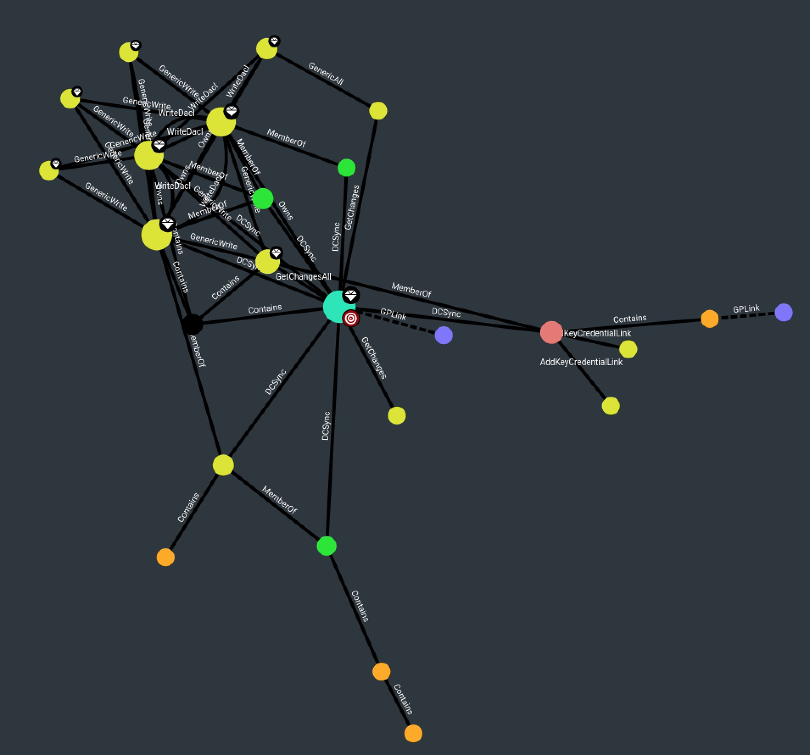


Shortest Paths from Domain Users to High Value Targets

```cypher
MATCH p=shortestPath((g:Group {name:"DOMAIN USERS@ZA.TRYHACKME.COM"})-[*1..]->(n {highvalue:true})) WHERE g.objectid ENDS WITH "-513" AND g<>n return p
```


Find Shortest Paths to Domain Admins

```cypher
MATCH p=shortestPath((n)-[:MemberOf|HasSession|AdminTo|AllExtendedRights|AddMember|ForceChangePassword|GenericAll|GenericWrite|Owns|WriteDacl|WriteOwner|CanRDP|ExecuteDCOM|AllowedToDelegate|ReadLAPSPassword|Contains|GPLink|AddAllowedToAct|AllowedToAct|SQLAdmin|ReadGMSAPassword|HasSIDHistory|CanPSRemote|SyncLAPSPassword|AZAddMembers|AZAddSecret|AZAvereContributor|AZContains|AZContributor|AZExecuteCommand|AZGetCertificates|AZGetKeys|AZGetSecrets|AZGlobalAdmin|AZGrant|AZGrantSelf|AZHasRole|AZMemberOf|AZOwner|AZOwns|AZPrivilegedRoleAdmin|AZResetPassword|AZUserAccessAdministrator|AZAppAdmin|AZCloudAppAdmin|AZRunsAs|AZKeyVaultContributor|AZVMAdminLogin|AddSelf|WriteSPN|AddKeyCredentialLink*1..]->(m:Group {name:"DOMAIN ADMINS@ZA.TRYHACKME.COM"})) WHERE NOT n=m RETURN p
```


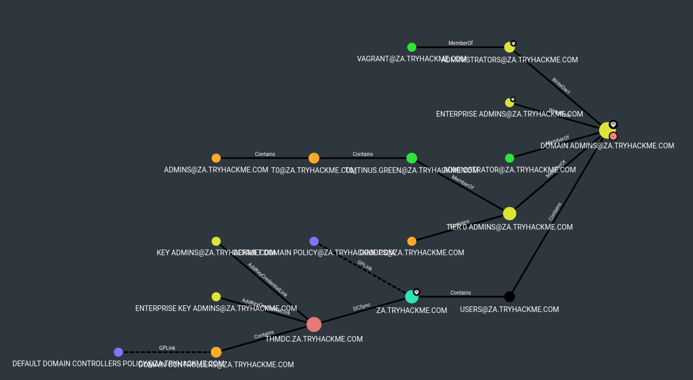


### Task 6 Answers


<details>
    <summary>Apart from the krbtgt account, how many other accounts are potentially kerberoastable?</summary> 
 <!-- empty line *️⃣  -->
4
</details>

```cypher
MATCH (n:User)WHERE n.hasspn=true RETURN n
```

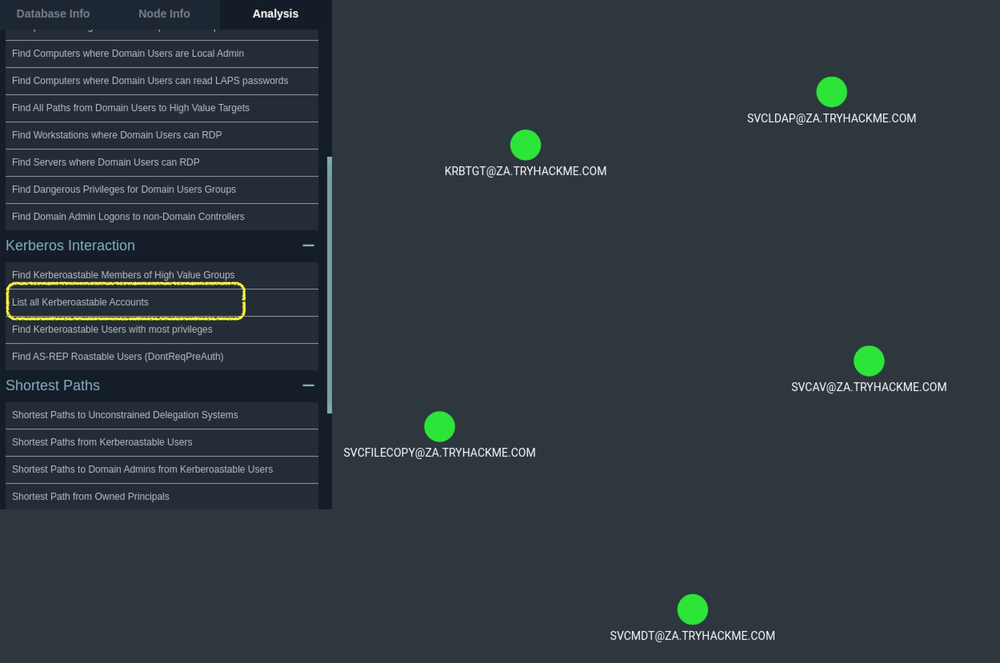

​                                                        

<details>
    <summary>How many machines do members of the Tier 1 Admins group have administrative access to?</summary> 
 <!-- empty line *️⃣  -->
2
</details>

```cypher
MATCH p=(m:Group {objectid: "S-1-5-21-3330634377-1326264276-632209373-1105"})-[r:AdminTo]->(n:Computer) RETURN p
```

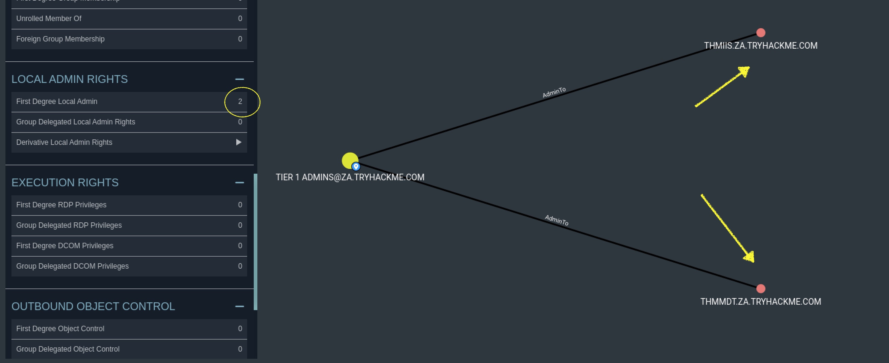


<details>
    <summary>How many users are members of the Tier 2 Admins group?</summary> 
 <!-- empty line *️⃣  -->
15
</details>

```cypher
MATCH p=(n)-[b:MemberOf]->(c:Group {objectid: "S-1-5-21-3330634377-1326264276-632209373-1105"}) RETURN p
```

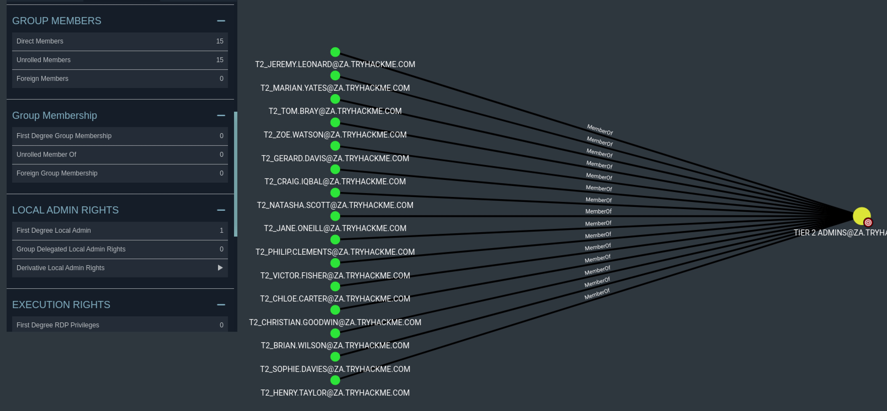


## References

https://mcpmag.com/articles/2019/12/02/dns-server-search-order-with-powershell.aspx